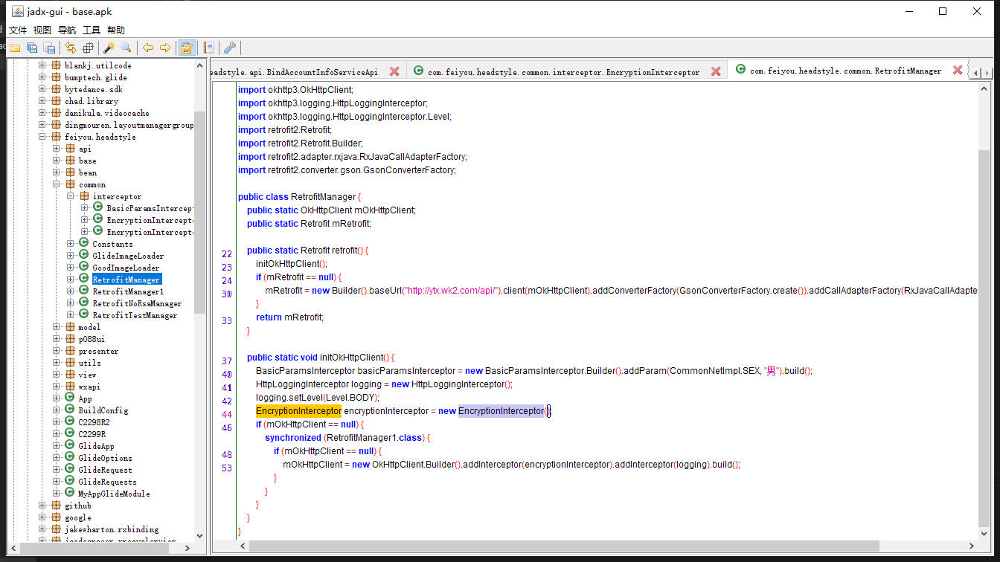

头像自动做任务
------------

安装目标软件  头像达人
-------

抓包
-------

   - **查看本机ip**   
   ctrl+R  
   输入 cmd  回车  
     
   输入 ipconfig  
     
   本机ip为 192.168.80.35  

   - **手机配置**  
   将手机连接至于抓包软件的PC同一局域网wifi 设置代理 
    
    
    
   
   - **开始抓包**  
   打开Charles  
   打开头像达人  
    
   获取到3个信息 
       1. http协议非https  
       2. 请求内容加密  
       3. 响应没有加密  

破解加密算法
-----------
   打开jadx 将头像达人apk 托入  
    
   搜索相关信息 比如 抓包url v1.welfare 
    
    
   结合抓包时的user-agent:是okhttp 熟悉android开发的同学一定知道这是用的retrofit + okhttp  
   搜索new OkHttpClient  
    
    
    
   找到加密码算法 byte[] strNewBody = RSAUtils.encryptByPublicKey(strOldBody, Constants.DEFAULT_PUBLIC_KEY);
   直接利用反编绎原码中 RSAUtils + Base64Utils  构造jar包
    
    
   **这里发现Base64引入的android的lib我们换成java的就行了** 
    
    
    
      
   **手动构造加密jar包** 
    
      
     
      

自动化做任务
----------
- 手动做一个任务
先手动做一个任务 观察抓包情况   
发现点击任务会请求http://ytx.wk2.com/api/v1.welfare/addusertask   
利用刚才java程序解密参数 看一下是如何构造的参数   
发现status为0时创建任务 并返回infoid   
status为1时利用infoid完成任务   
    
   
   
**实际运行情况**  
   

- 编写自动化脚本
[详见](dx.js)   